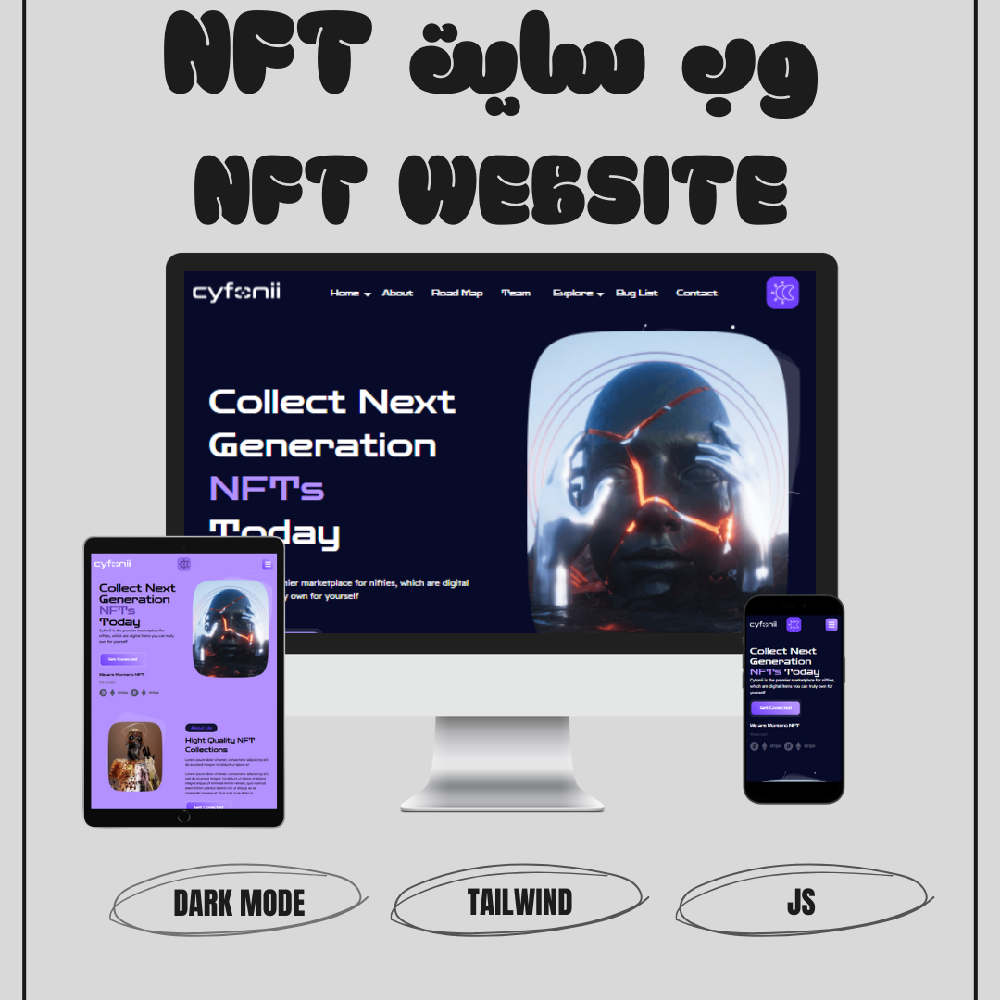
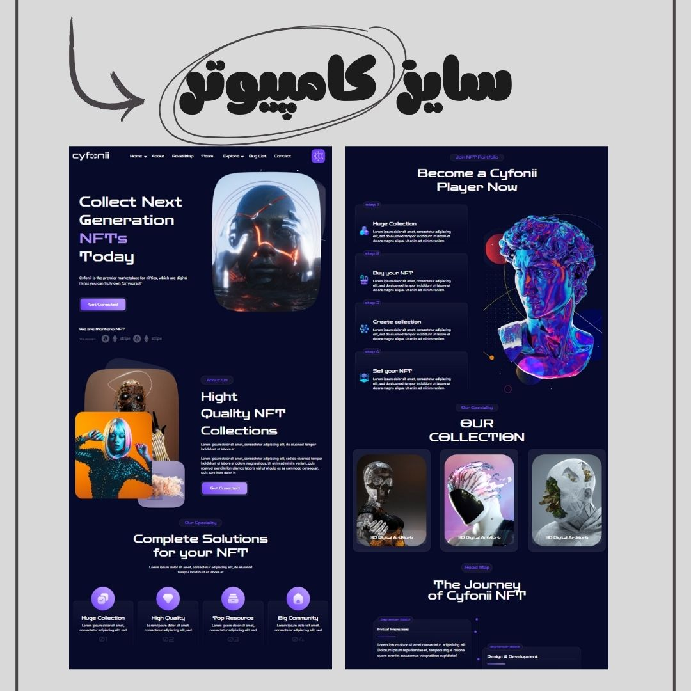
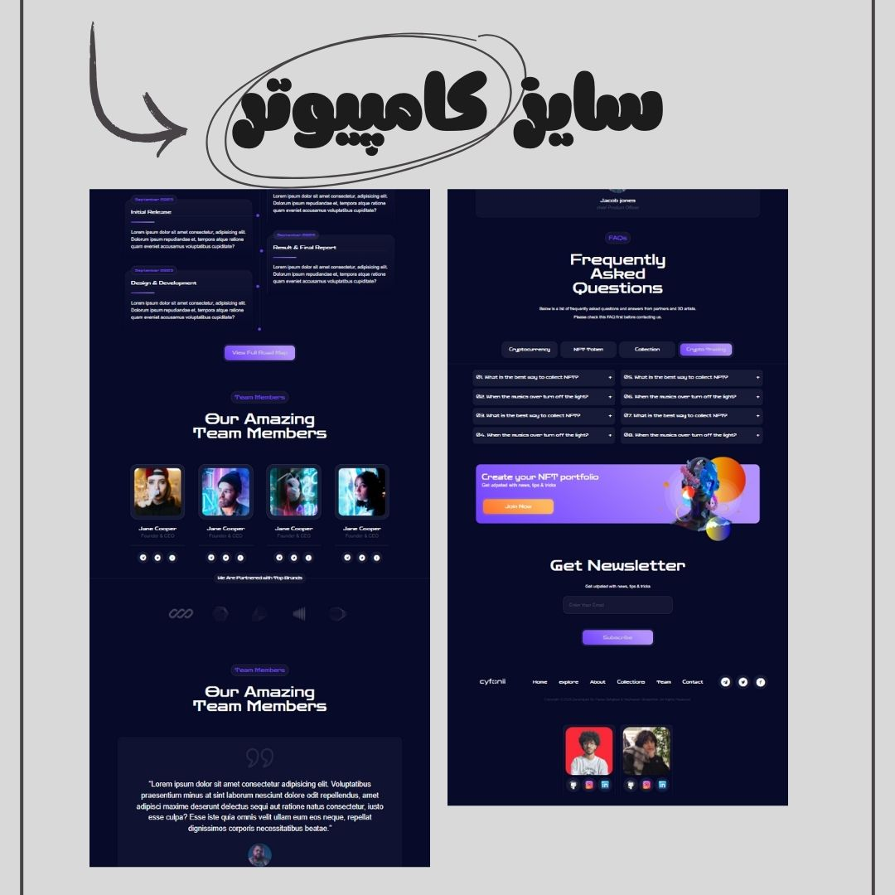
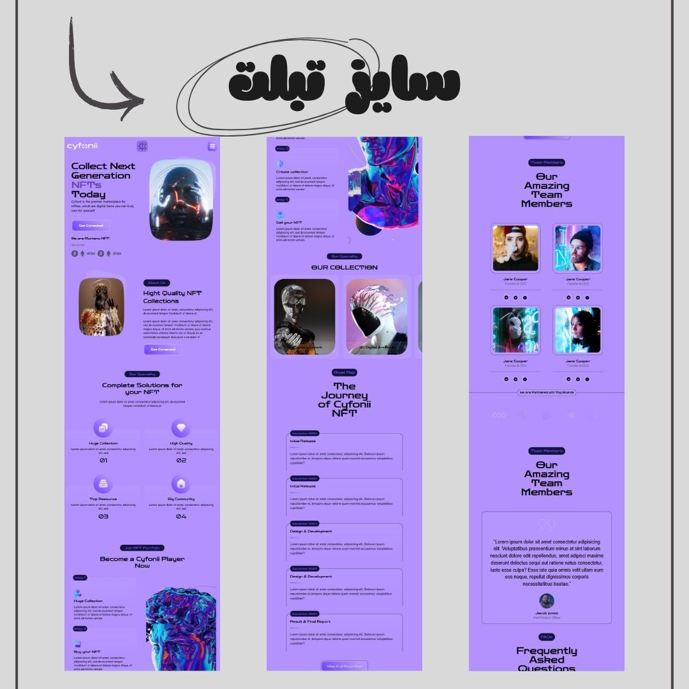
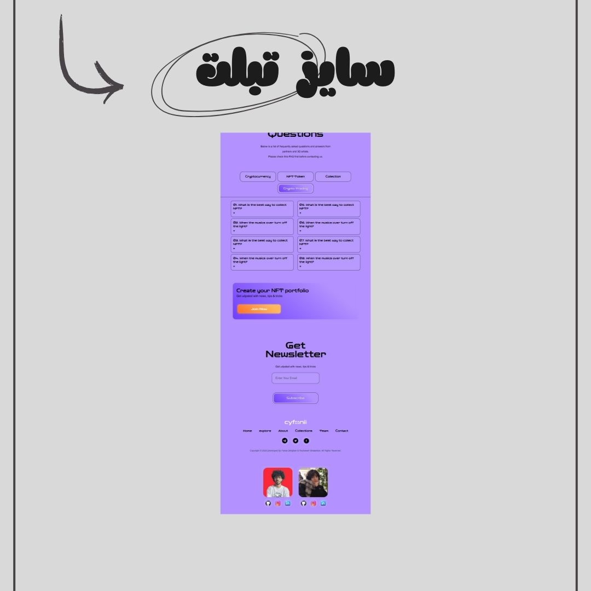
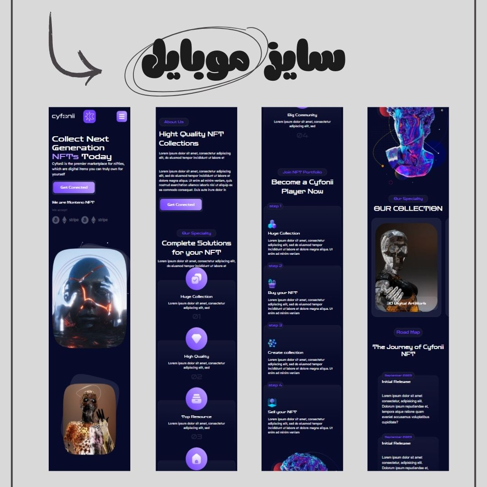
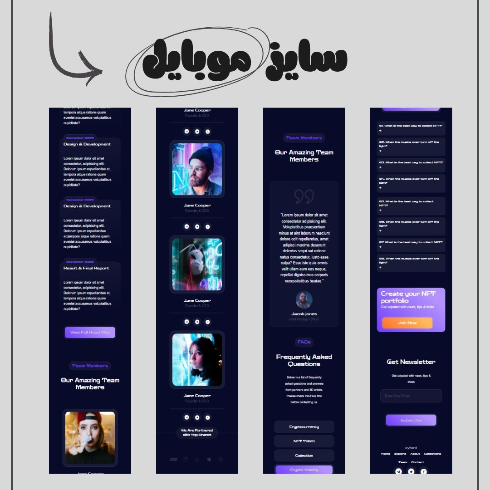

# 🌐 NFT Website – Collaborative Project with GitHub

A modern, fully responsive **NFT showcase website** built as a collaborative project using **HTML5, CSS3, Tailwind CSS, and JavaScript**.  
This project was a great practice in **teamwork with Git & GitHub**, where we handled branches, merges, and collaboration seamlessly.

The website features a **responsive navigation menu for mobile**, an **accordion component**, and **dark/light mode** toggle — all powered by **Vanilla JavaScript**.

این پروژه یک وب‌سایت مدرن و ریسپانسیو برای نمایش NFTهاست که با همکاری تیمی و استفاده از GitHub توسعه داده شده. من و دوستم ریحانه روی گیت به‌صورت کامل کار کردیم و تجربه فوق‌العاده‌ای در مدیریت شاخه‌ها و مرج گرفتن داشتیم. ویژگی‌های سایت شامل منوی موبایل با جاوااسکریپت، آکاردئون، و دارک/لایت مود است.

---

## 📅 Created on | تاریخ ساخت

**Thursday, 4 September 2025 | پنج شنبه 13 شهریور**

---

## ✨ Features | ویژگی‌ها

- 📱 **Fully Responsive** – optimized for desktop, tablet, and mobile
- 🌗 **Dark Mode & Light Mode** toggle (JavaScript powered)
- 📂 **Accordion Component** for structured content
- 📑 **Mobile Menu** with smooth toggle functionality
- 🤝 **GitHub Collaboration** – branches, commits, merges
- 🎨 Built with **Tailwind CSS** for a modern and clean UI

---

## 🛠️ Tech Stack | تکنولوژی‌ها

- **HTML5**
- **CSS3**
- **Tailwind CSS**
- **JavaScript (Vanilla)**
- **Git & GitHub** (collaboration & version control)

---

## 👥 Collaborators

| Name               | GitHub Username                                    | Role                |
| ------------------ | -------------------------------------------------- | ------------------- |
| Parsa Deghanpour   | [@parsa-farshah](https://github.com/parsa-farshah) | Creator & Developer |
| Reyhaneh Ghalambor | [@reyhanneh-gh](https://github.com/reyhanneh-gh)   | Creator & Developer |

---

## 🔧 Project Mentor | مربی پروژه

[@parsa_ghorbanian_web](https://www.instagram.com/parsa_ghorbanian_web)

---

## 🔗 Live Demo

👉 [View NFT Website](https://parsa-farshah.github.io/TeamProject4/)

---

## 📸 Project Screenshots | پیش‌نمایش پروژه

### 🌟 Overview

### 💻 Desktop View

 

### 💻 Desktop View

 

### 📱 Tablet View

### 📱 Tablet View

### 📱 Mobile View

 

### 📱 Mobile View

 

---

## 📲 Connect with Us | ارتباط با ما

- 📸 Instagram: [@parsa_dehghanpour_dv](https://www.instagram.com/parsa_dehghanpour_dv)
- 💼 LinkedIn: [Parsa Dehghan Pour Farashah](https://linkedin.com/in/parsa-dehghan-pour-farashah-85ab04250)
- 💻 GitHub: [parsa-farshah](https://github.com/parsa-farshah)
- 🎥 YouTube: [@FrontEndFresh](https://www.youtube.com/@FrontEndFresh)
- 📩 Email: parsafarashah2002@gmail.com

---
